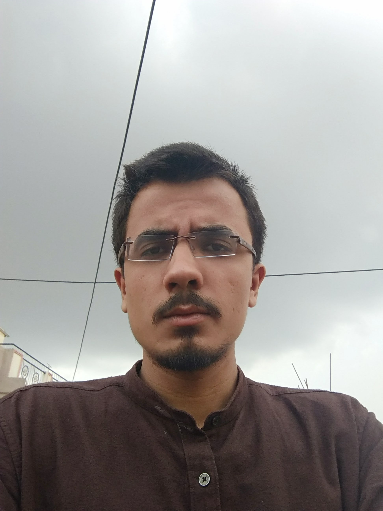

# Portfolio

  

  
Hi, my name is Ashish Karel.

I am an avid manga reader, sci-fi reader, and loves to run my current PA is 2.1km/7minutes. I love to learn about how things work, whether that be studying good coding practices, engineering techniques, or machine learning methods. Much of my experience revolves around building machine learning applications, but I also strive to gain a deeper understanding of the world so that I can expand my skillset and build new and amazing things.

# Get to Know Me 

### My Professional Experience

  

Computer Vision engineer with extensive experiecne of around 2 years in designing and developing multiple large-scale products in AI, Computer Vision, Machine Learning, Deep Learning domain, in an end-to-end manner.

As a Pattern Recognition enthusiast,I also have some experience in NLP(Natural Language Processing) and ASR(Automatic Speech Recognition).

* Well-versed with python, c, c++, data-structres and algorithms
* Experienced with frameworks including Pytorch, Tensorflow, Keras
* Skilled in Image Processing, Computer Vision, and Deep Learning, software developemnt skills
* High familarity with libraries such as OpenCV, Pandas, Numpy, Scikit, SkLearn, Flask, DLib, QT and version control tool such as Git.
* Experienced working on Unix and Microsoft OS, and exposure to Raspbian OS and embedded hardware such as Raspberry Pi and Nvidia Jetson Nano.
* Exposed to model optimization techniques using TensorRT, OpenVino, Tflite and other frameworks.
* Exposed to web services such as AWS, Google cloud, Azure and Heroku 

* Computer Vision applications : object detection, object classification, face detection and recognition, handwriting detection, OCR, object tracking ,image search,  motion analysis, keyframe extraction.
* NLP             applications : Information retrieval and summarizer .
* Deep Learning           models : VGG-16, Resnet, InceptionNet, Mobilenet, Yolo, ssd-resnet10, ssd-mobilenetv2, U-net, Siamese Network, MaskedRCNN, FlowNet, 
* Image Processing    algorithms : HoG, SURF, SIFT, LBP, Canny Edge Detector, Optical Flow, Filters, background-subtraction, 
* Machine Learning    algorithms : SVM, Decision Trees, KMeans, KNN, Dbscan, TF-IDF, LDF, BoV, 

My research papers addresses the problem of activity recognition in cricket trimmed videos, and describes how we used semi-supervised approach and intergrating ideas from NLP and image processing to tackle the problem. 

Having worked on multiple developemnt and research projects, I find myself well equipped with research and project management skills that are necessary for AI based roles, and hence, I'm looking forward for such roles where I can create a positive impact and solve real world problems.

# Experience

## KritiKal Solutions

### Computer Vision Engineer .
* Document-image OCR and retrieval based system using image processing and tesseract
	* Task was to extract information from NCERT textbook images and retrieve the page information for further use case.
	*  Users were mostly indian school kids or parents doing self study.
	*  Worked on line extraction from books image which sometimes were blurred, tilted, and curved using contour processing
	*  Main hindrance to accurate system were blurred images(motion or focus), white noise or uneven lighting while capturing images.
	*  Performed quality check using variance of laplacian and deblurring after removing gaussian noise(assumed blur noise to be gaussian)
	*  OCR was used on all extracted lines from the images and saved text file for retrival.  
	*  Evaluated tablet which was going to be used for our OCR system, such as focus, exposure, shutter time, frame quality etc and comapred performance of system on normal images and images from tablet.
	*  Tech-stack: c++, Opencv, python, ocr, linux, windows

* Speech Recognition and analysis in kids speech to augment their language learning phase.
	*  Created pipeline to collect data for kids below 11 years
	*  Performed benchmark of existing SOA (like DeepSpeech2) on the dataset for speech to text
	*  Research on speech recognition model for kids speech and the feasability of existing SOA.
	*  Tech-stack: python, pytorch-kaldi, tensorflow, linux, sst engines, 

* Counting the number of crates unloaded in a factory warehouse using video feed.
	*  Data annotation and analysis from warehouse camera feed
	*  Performed background subtraction for detecting regions of motion 
	*  Trained yolo detection for crate detection and then counting
	*  Python executable was delievered for user testing
	*  Tech-stack: darknet, c++, python, linux, windows, Opencv

* 3D-barcode detection and spoof classification from 2D images.
	*  Trained Yolo to detect the 3d marker in images .
	*  Proposed data collection for classification using micromax smartphone .
	*  Proposed different types of printing paper for stimulating spoof attack like Matte, Gloosy, Laser etc
	*  Spoof classifier was trained using SVM on texture features extracted using LBP.
	*  Tech-stack: darknet, c++, python, linux, windows, Opencv

### Computer Vision Trainee.

* Displaction calculation of washing machine.
	*  Required to predict the displacment within -+5mm of actual displacement.
	*  Performed camera calibration, and perspective transformation from image to world coordinate system.
	*  Proposed camera and aruco marker ideal setup after numerous experiment 
	*  performed experiment and error analysis on geometric algorithms in 3D world; this repeated till we get our required threshold error.
	*  Developed UI for the desktop application which runs 4 camera parallely.
	*  Finally application is used during manufacturing process to identify faulty washing machines.
	*  Tech-stack: c++, windows, QT Designer, Opencv

* Face Detection comparision
	*  Compared Opencv's (Haar and cascade based face detector) and dlib(HoG + SVM based face detector) face detection methods.
	*  Analysed their performance by varying the distance.
	*  Tech-stack: Opencv, Dlib, python, linux

* 3D bone segmentation from MRI images of patients for pre-surgery analysis
	*  Client wants us to handle the 3D patients bone segmentation for surgeons to perform virtual operations before operating on patients
	*  Researched on clients segmentation tool and human autonomy before presenting our solution
	*  Performed live segmentation in a meeting and fine tuned the results using hyperparameters in the tool
	*  Proposed to supervise more than 10 employees for the task
	*  tech-stack: MRI scans, windows, segmentation tool

* Grading Skin Health
	*  Proposed to predict the health of skin after accounting wrinkles, tone, texture , marks(pimples or lesions)
	*  Image processing algorithms such as LBP for tone and texture score, edge detection and fitting to polynomial function for wrinkles score and contur based detection for marks or non-uniformity score in skin.

## LNMIIT
## Sub-coordinator Of Data-Science club 
	*  I was a sub-coodinator of Data-Science of CYBROS(a technical community club at LNMIIT), introducing and guiding students at LNMIIT in Data Science and sub fields.

## Cell Propulsion Limited

### Python Developer Intern.
* Sensor Fusion
	*  Part of Computer Vision team on Self Driving Car.
	*  Setup Texas instrument's radar sensor in my laptop and processed the binary data into visualization plot
	*  Performed clustering of detection to decrease the number of false detection (using linear kalman filter and dbscan)
	*  Evaluated the radar by mounting on self driving car to determine its feasiblity
	*  Proposed 12 radar required for covering detection from all directions
	*  Tech-stack: Python, Kalman filter, linux, Texas instruement radar sensor

## LegalHub Technologies Pvt. Ltd.
### NLP Engineer Intern.

* Document Retrieval System
	*  Developed Search Engine for Indian Law DataSet.
	*  We have tested different types of searching algorithms on Indian Law DataSet
	*  Methods used: word2vec, doc2vec, LDA, n-gram's, tf-idf 
	*  Implemented extraction based summarizer and query based summarizer .
	*  Implemented filtering on search results and deployed an overall system on localhost.

## NVIDIA Developer Conference 2019
* Participation as a Student
	*  Participated at NVIDIA's developer conference held at mumbai.
	*  This conference was aimed to bring all developers together and discuss current technologies in Deep learning and how industries utilises them.
	*  Tech-stack: python, keras, linux, AWS

## Silversparro Technologies Pvt. Ltd.

### Deep Learning Engineer Intern.
*  Worked on Masked-RCNN to segement text lines from the reciept images to improve existing OCR model.
	*  Tech-stack: python, tensorflow, keras, AWS
*  Worked on speech to text for a large e-commerce company on customer service recordings.
	*  Tech-stack: python, tensorflow, keras, sst engines, AWS
*  Worked on voot website customer data to predict the customer engagement: performed text analysis and cleaning(>40GB) and initial model creation
	*  Tech-stack: python, tensorflow, keras, sst engines, AWS

## Talk on Mask-RCNN on Image-Segmentation.
* Particiapted as a Presenter
	*  I had delivered a talk on Masked-RCNN at Delhi's Data Science Meetup.
	*  Report can be found [here](https://docs.google.com/presentation/d/13tW8yzSrJy5EglmkPqpKS_Fg5GMvY77CmsbAzdGm4n0/edit?usp=sharing).

# Projects

## Independent Projects

* face detection and Mask and Helmet classifiaction
	*  Classified if construction workers wore helmet and mask 
	*  Used mobilenetv2+ssd for face detection and mobilenetv2 for multilabel classification
	*  Tech-stack: python, tensorflow, colab, numpy

* Clustering-species

	*  To cluster a variety of species required complex clustering algorithms and simpler KMeans won't be effective.
	*  I have used variuos approaches like elbow methods and hiearchical clustering methods.
	*  Tech-stack: numpy, python, linux, sklearn, pandas
	*  Implementation is available [here](https://github.com/blitu12345/Cluster-Species).

* Content-based recommender system 
	*  Implemented a content based recommender system to recoomend genre, books for user for a typical bookstore website.
	*  Tech-stack: numpy, python, linux, sklearn, pandas
	*  Code can be found [here](https://github.com/blitu12345/Recommender-system).

* DeepLearning Implementations

	*  Handwritten digit recognition on MNIST implemented using tensorflow.Code can be found [here](https://github.com/blitu12345/Code-With-DL/tree/master/tensorflow/Convnets)
	*  Implemented logistic regression using Tensorflow.Code can be found [here](https://github.com/blitu12345/Code-With-DL/tree/master/tensorflow/logistic%20regression%20examples)
	*  Implemented linear regression using Tensorflow. Code can be found [here](https://github.com/blitu12345/Code-With-DL/tree/master/tensorflow/linear_regression_examples)
	*  Implemented Shallow neural network in pytorch.Code can be found [here](https://github.com/blitu12345/Code-With-DL/tree/master/pytorch).
	*  Tech-stack: numpy, python, linux, tensorflow, pytorch, AWS

## The LNM Institute Of Information Technology

* Institute Map
	*  Guidance mobile app for people's first visit(like parents, new joinee and admission students) to LNMIIT being a vast campus of 100 acres with huge infrastructure . 
	*  In this project we collected multiple images of 7 different locations of LNMIIT .
	*  With this app, user just need to input its surrounding image, and it will recognises the input image, this can locate and guide user to pinned location in college map.
	*  Api creation using flask, and deployed on [heroku](https://herokuapp.com)
	*  This is a detailed [report](https://docs.google.com/document/d/1hKfg-HvGp5Ig-I96A8APbMGFkrJR_WZpYwJ2GV0ABY4/edit?usp=sharing).
	*  Tech-stack: numpy, opencv, sklearn, python, linux, heroku, flask

* Shallow NN code from scratch
	*  Implemented neural-network code from scratch using python and numpy.
	*  You can find the implemented code [here](https://github.com/blitu12345/kaggle/blob/master/MNIST).
	*  Tech-stack: numpy, python, linux
	*  On MNIST dataset my 2 layered network attained an accuracy of ~92%.

## Kaggle 

* [Cats vs Dogs classifiaction](https://www.kaggle.com/c/dogs-vs-cats)
	*  Implemented a VGG-16 net from scratch
	*  Used pretrained weights as initialization in keras to solve this problem.
	*  Tech-stack: numpy, python, linux, keras, AWS
	*  Code can be found [here](https://bitbucket.org/blitu12345/deepcodesbase/src/b18ad9bfe9b7280fe694791f085dfcfbd69cd1cb/CatsandDogs/?at=master).

* [Titanic](https://www.kaggle.com/c/titanic): Machine Learning from Disaster
	*  Binary classification problem, to predict whether a person on titanic survived or not.
	*  Obtain an accuracy of 81.34%,within top 7%.
	*  Used several models like Logistic Regression,SVM and Decision tress,but after performing data analysis and feature extraction its seems RandomForest Classifier results performed well on all evaluation metrics.
	*  Code can be found [here](https://github.com/blitu12345/kaggle/tree/master/titanic).
	*  Tech-stack: numpy, python, linux, sklearn, pandas

* HandWritten Digit Recognition
	*  Digit Recognition challenge on [kaggle](https://www.kaggle.com/c/digit-recognizer) .
	*  I used Machine learning multi class classification models like Logistic regression, SVM, KNN with help of sklearn.
	*  Code can be found [here](https://github.com/blitu12345/kaggle/tree/master/digitRecognition).
	*  Tech-stack: numpy, python, linux, sklearn

* House Prices: Advanced Regression Techniques
	*  This is a regression problem: based on information about houses we predict their prices.
	*  General description and data are available on [Kaggle](https://www.kaggle.com/c/house-prices-advanced-regression-techniques).
	*  Used Supervised Learning methods to predict Boston house prices. With ensemble modelling and feature engineering my model was finally able to predict prices with high confidence.
	*  Tech-stack: numpy, python, linux, sklearn, pandas

## Hackerearth

* HackCovd 2.0(Hackathon)
	*  Created a real-time desktop integrated with surveillance camera to monitor covid regulations are followed
	*  Used nanodet(anchor free detection model) for pedestrain detection
	*  For face detection used resnet10+ssd and mobilenetv2 for mask classification 
	*  Tech-stack: python, pytorch, tensorflow, pyQt5, numpy, linux
	*  Code can be found [where]()

* Loan Prediction
	*  To help Indessa Bank identify default members(unable to satisfy terms of loan).
	*  Dataset containing 1 lakh members detail and with 45 features each.
	*  Applied feature engineering, statistical test (like chi-square test ,t-test and Pearson correlation),visualisation techniques(box plot,scatter plot,histogram and bar chart)
	*  Tested Logistic Regression,Random Forest and XGBoost.
	*  I was able to secure a rank within top 4% of users.
	*  Tech-stack: numpy, python, linux, sklearn, pandas
	*  Code can be found [here](https://github.com/blitu12345/-Bank-Fears-Loanliness)

* [The Cab Service](https://www.hackerearth.com/challenge/competitive/machine-learning-indiahacks-2017/)
	*  Contest held on hackerearth, aimed to help company predict the trip fare amount using modern Machine Learning approaches.
	*  Tech-stack: numpy, python, linux, sklearn, pandas
	*  Code can be found [here](help company to predict the trip fare amount)
